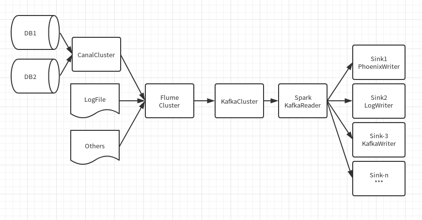

# RealTimeMySQL-实时MySQL数据同步方案
--------------------------------------------------------

## 简介

#### 解决的难题
1. MySQL批量同步响应慢
2. MySQL批量同步储存不易恢复
3. 常规落地方案易产生HDFS小文件

#### 技术选择
1. mysql读取方面选择 canal 作为日志抽取
2. 日志收集惯例的采用flume+kafka的方法
3. 实时数据处理使用Spark StructStreamming
4. 数据落地使用 Phoenix+HBase

#### 数据流展示

#### 需要注意的问题
1. 数据节点的Failover/Recover问题
2. 全流程的数据有序保证和恰好一次保证
3. 扩容时涉及的问题

#### 恰好一次的保证
如果需要恰好一次的保证，需要且必须要全流程每个节点都保证恰好一次，否则将无法正确有效的保证
当全流程保证好的话，写入端如果需要保证恰好一次，有以下三种办法:

1. 在写入后记录写入的游标，后续遇到则不再操作
2. 整个写入流程是事务性的，如果失败的直接rollback
3. 写入行为是幂等的，此时只需要保证数据至少一次就可以了
  
#### 数据有序的保证
在kafka中，只能保证partition中的有序，partition之间的有序是无法保证的，即只能保证局部有序,如何保证同种数据写入同一partition就是我们需要解决的问题。在spark streaming中读取kafka的数据是一个kafka partition对应一个RDD partition，所以我们可以直接有效的保证rdd内部的顺序问题
  
#### Spark StructStreaming ForeachWriter的小知识
1. StructStreaming的sink基于自身的checkpoint机制，可以达到至少一次的保证
2. 每个partition都会创建一个ForeachWriter实例

#### Phoenix使用中遇到的一些问题
1. SQL中的问题
      1. 时间类型与SQL92不一致
      2. 类型必须严格一致
      3. 转义字符与大小写的问题
2. PK与二级索引的数据
      1. pk必须是非空的
      2. pk字段的顺序可以理解为HBase的Rowkey的顺序
      3. pk必须保证唯一性！重要！！
      4. 二级索引需要命中你where和select的字段
      
## 实施方案

#### CanalSource

版本：
- Canal:1.0.24
- flume:1.7.0

抽取流程：
1. 从Canal getWithoutAck的方式抽取一批数据
2. 将其转化成定制的RowData
3. 事务式写入到Channel中
4. Canal ack

特别的东西：
1. 需要把source(此处是数据库)作为Kafka的Key，FlumeEvent的header需要放入KafkaSinkConstants.KEY_HEADER参数
2. 需要保证canal的连接是随时可以重连的，即使canal服务器重启也不能干扰到flume的应用的稳定性

后话：有一个至今没有解决的问题：canal的高可用中的zkclient依赖与flume的zkclient依赖冲突问题

#### KafkaReader

版本：
- Spark: 2.3.0
- HBase: 1.2.4
- Phoenix: 4.13.1
- Kafka: 0.10.0.1

抽取流程：
1. 从kafka分区中读取数据
2. 将每一行的数据转化成PhoenixSQL
3. 执行PhoenixSQL

特别的东西：
1. 为了保证数据的一致有效，需要保证每个表的数据是有序写入的
2. Phoenix的写入在数据有序的情况下，是幂等的，所以只需要保障局部有序和至少一次，就可以完成恰好一次的保证
3. 需要注意不是所有类型都是支持和兼容的
4. Phoenix的转义很讲究，不转义的话是大小写不敏感的，转义了就敏感了，而且转义字符是"而不是`
5. 在SQL构建时，数值型的不能用字符串类型进行插入，反之，字符串型的必须指明为字符串，否则也会报错！重要！！

## 关于kafkaReader的想法
将从kafka读取进来的数据按照设置进去的放到导流到指定的地方，这就是把Reader和Worker分开实现的原因，用户可以自定义worker来实现自己想要达到的效果，也能配置自带的sink来满足不同的需求的设计思路，1个Reader对应一个KafkaSource,一个Worker对应一个Sink，一个KafkaSource可以流向N个Sink
